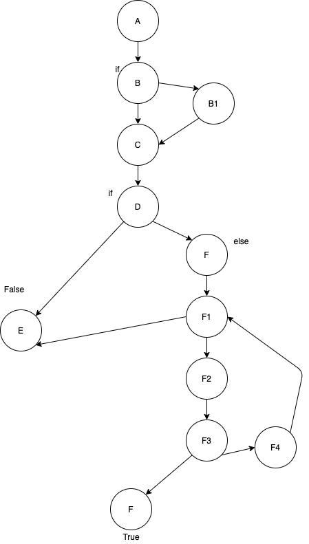

# Втора лабораториска вежба по Софтверско инженерство

## Ристо Раданлиев, бр. на индекс 141191

### Група на код: 

Ја добив групата на код Check Prime

###  Control Flow Graph

### Цикломатска комплексност

Цикломатска комплексност на кодот е 6. 
Го пресметав со формулата E - N + 2P, каде Е е број на темиња, N е број на јазли, P е број на завршетоци. 
(12 - 10 + 2*2)

### Тест случаи според критериумот  Every statement 

....

### Тест случаи според критериумот Every path

.... 

### Објаснување на напишаните unit tests

...
...